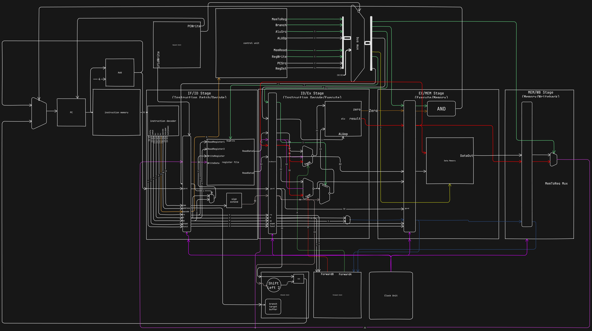

> ### Report: https://docs.google.com/document/d/10988V4THck_VjlVM9gS4_aE0piDJ1uK7xjHn-jshYB0/edit?usp=sharing
>
> ### Spreadsheet: https://docs.google.com/spreadsheets/d/1RUNOOiJ3DZ2heZ5_la7ENw52pGrtweVW7ax-dkXzsRU/edit?usp=sharing
>
> ### WhenToMeet: https://www.when2meet.com/?27331718-g3Ah7
>
> ### Discord: https://discord.gg/JrZtEWpW
https://huly.app/login/join?inviteId=674ce8edf6c7bf03784f0694&navigateUrl=%7B%22path%22%3A%5B%22workbench%22%2C%22cpre381%22%2C%22love%22%5D%2C%22query%22%3A%7B%22sessionId%22%3A%22674ce6ea9c2a819aaf3f74f3%22%7D%2C%22fragment%22%3A%22%22%7D
# sfhw-proj2



## Structure

```bash
.
├── LICENSE
├── README.md
├── README.png
├── src_sc (the source code of the single cycle implementation)
│   ├── LICENSE
│   ├── README.md
│   ├── README.png
├── src_sf (the source code of the software scheduled pipelined multi-cycle implementation)
│   ├── LICENSE
│   ├── README.md
│   ├── README.png
└── src_hw (the source code of the hardware scheduled pipelined multi-cycle implementation)
    ├── LICENSE
    ├── README.md
    └── README.png
```
