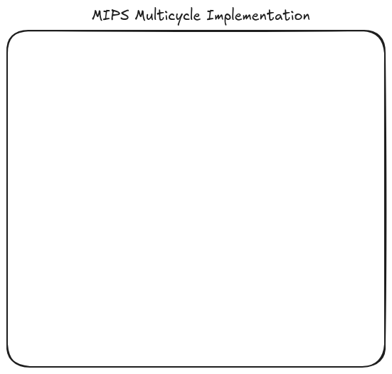

> ### Report: https://docs.google.com/document/d/10988V4THck_VjlVM9gS4_aE0piDJ1uK7xjHn-jshYB0/edit?usp=sharing
>
> ### Spreadsheet: https://docs.google.com/spreadsheets/d/1RUNOOiJ3DZ2heZ5_la7ENw52pGrtweVW7ax-dkXzsRU/edit?usp=sharing
>
> ### WhenToMeet: https://www.when2meet.com/?27331718-g3Ah7

# sfhw-proj2



## Structure

```bash
.
├── LICENSE
├── README.md
├── README.png
├── Single-Cycle-Processor
│   ├── LICENSE
│   ├── README.md
│   ├── README.png
├── Software-Scheduled-Processor
│   ├── LICENSE
│   ├── README.md
│   ├── README.png
└── Hardware-Scheduled-Processor
    ├── LICENSE
    ├── README.md
    └── README.png
```
